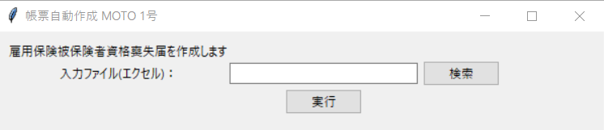
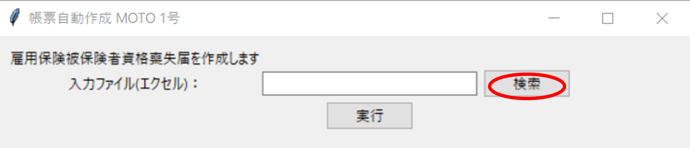
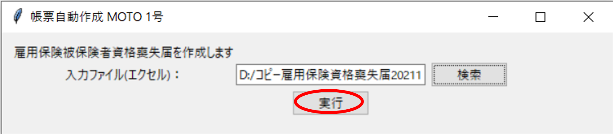

# MOTO_1(雇用保険被保険者資格喪失届　自動作成)
エクセルファイルから雇用保険被保険者資格喪失届を自動生成するアプリです

## このソフトの動作には以下の環境が必要です
* Windows PC
* Chrome (ブラウザ)
## ダウンロード方法
web_auto.exeをクリックし、ダウンロードしてください(ブラウザにて警告が表示される場合がありますが問題ありません)

## 使用方法
### 1. web_auto.exeの起動
* web_auto.exeをクリックし、起動してください、初回は以下のような画面が表示されます

* 実行後は以下のアプリが起動します(*起動には少し時間がかかります)

### 2. アプリの使い方
検索ボタンで雇用保険被保険者資格喪失届のデータファイルを選択し

実行ボタンを押せば業務が終了します

### 3. 注意点
* このアプリではハローワークインターネットサービスの機能を使用しています、サイトの閉鎖・変更等があればアプリは使用できなくなります
* 現在アプリは製作途中です(2021/11/28)、随時アップデートを行います